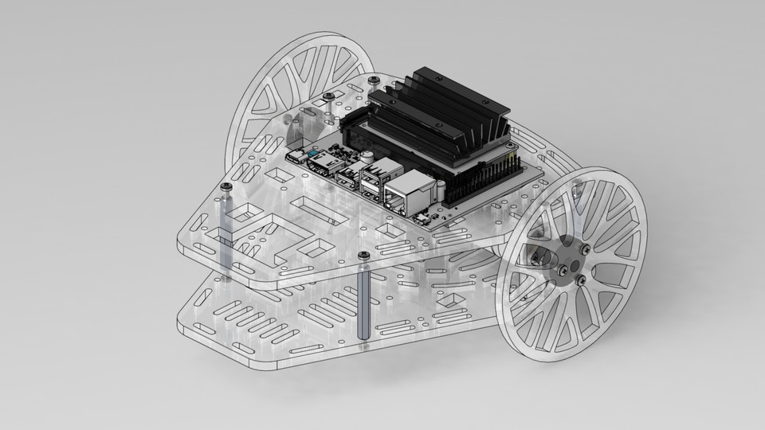

# Autonomous Robot with ROS2, Differential Drive, and YOLO Instance Segmentation



## Table of Contents
- [Introduction](#introduction)
- [Features](#features)
- [Hardware](#hardware-requirements)
- [Software](#software-requirements)
- [Project Structure](#project-structure)
- [Contributing](#contributing)
- [License](#license)
- [Acknowledgements](#acknowledgements)

## Introduction
This project aims to develop an autonomous robot utilizing ROS2, a differential drive mechanism, and YOLOv8 for instance segmentation. The robot is capable of navigating autonomously while detecting and segmenting objects in its environment.

## Features
- Autonomous navigation using ROS2
- Differential drive control
- Real-time object detection and segmentation using YOLOv8
- Environment awareness

## Hardware 
- Differential drive robot chassis
- Jetson Nano SBC (Single Board Computer)
- Camera module
- Hackerboard ESP32 based microcontroller
- Battery pack

## Software Requirements
- ROS2 Humble
- Python 3.12
- OpenCV
- YOLOv8
- Pytorch

## Project Structure
```
your-repo-name/
├── config/
│   ├── 
│   └── 
├── launch/
│   ├── 
│   └── 
├── src/
│   ├── /
│   │   └──
│   ├── /
│   │   ├──
│   │   └──
└── README.md
```

## Contributing
Contributions are welcome! Please follow these steps to contribute:
1. Fork the repository.
2. Create a new branch (`git checkout -b feature-branch`).
3. Commit your changes (`git commit -m 'Add some feature'`).
4. Push to the branch (`git push origin feature-branch`).
5. Open a pull request.

## License
This project is licensed under the MIT License - see the [LICENSE](LICENSE) file for details.

## Acknowledgements
- [ROS2](https://docs.ros.org/en/humble/index.html)
- [YOLO](https://pjreddie.com/darknet/yolo/)

---